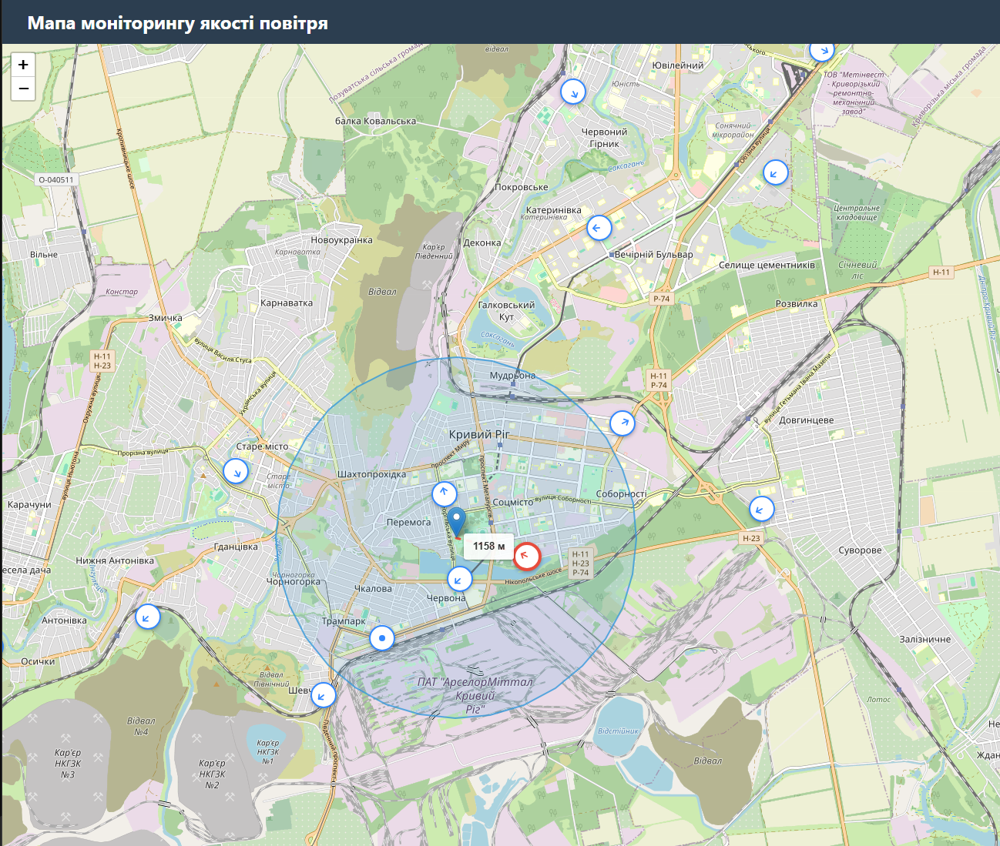

# Дипломна робота: Моніторинг повітря (FastAPI + React.js)

**Виконав:** Фарізов Максим Сергійович, студент 2-го курсу магістратури, спеціальності математика групи Диференціальні рівняння та математичні моделі, механіко-математичного факультету, м. Київ.

Проект складається з трьох основних компонентів: Бази даних PostgreSQL з геопросторовим розширенням PostGIS, Backend на FastAPI (Python) та Frontend на React.js (Vite).



## 1. Налаштування Бази Даних (PostgreSQL + PostGIS)

Для локального запуску проекту потрібно відновити базу даних із бекапу.

1. Встановіть **PostgreSQL** (бажано версію 13+) та розширення **PostGIS**.
2. Створіть нову порожню базу даних (наприклад, `geo_air_monitoring`).
3. Відновіть базу даних з файлу бекапу, який знаходиться в корені проекту (`geo_air_monitoring.backup`).
   - За допомогою командного рядка:
     ```bash
     pg_restore -U postgres -d geo_air_monitoring -1 geo_air_monitoring.backup
     ```
   - Або за допомогою pgAdmin: створіть базу даних, натисніть по ній правою кнопкою миші -> `Restore...` -> оберіть файл `geo_air_monitoring.backup`.

*(Якщо у вас налаштовані інші логін/пароль для підключення до БД, скоригуйте їх у `backend/database.py` або `backend/.env` перед запуском)*

## 2. Налаштування Backend (FastAPI)

### Вимоги
- Python 3.9+

### Встановлення та запуск

1. Перейдіть до папки backend:
   ```bash
   cd backend
   ```
2. Створіть віртуальне середовище:
   - Windows: `python -m venv venv` або `py -m venv venv`
   - Mac/Linux: `python3 -m venv venv`
3. Активуйте віртуальне середовище:
   - Windows: `.\venv\Scripts\activate`
   - Mac/Linux: `source ./venv/bin/activate`
4. Встановіть залежності:
   ```bash
   pip install -r requirements.txt
   ```
5. Запустіть API сервер:
   ```bash
   python main.py
   ```
   *Сервер буде доступний за адресою: http://localhost:8000*

## 3. Налаштування Frontend (React.js)

### Вимоги
- Node.js (рекомендовано версію LTS)

### Встановлення та запуск

1. Перейдіть до папки frontend (нове вікно терміналу з кореня проекту):
   ```bash
   cd frontend
   ```
2. Встановіть npm-залежності (Leaflet, React, тощо):
   ```bash
   npm install
   ```
3. Запустіть сервер для розробки:
   ```bash
   npm run dev
   ```
   *Клієнтський додаток буде доступний за адресою: http://localhost:5173 (точну адресу покаже термінал)*

---
**Після успішного запуску Backend і Frontend відкрийте посилання Frontend у браузері, щоб переглянути мапу.**
